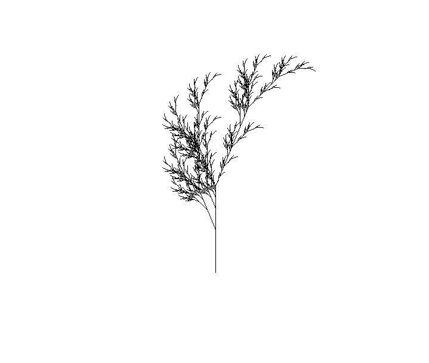

# DSL for generating fractal plants

In order to run this program you need to install GhostScript (it is used to save the result as a jpg file).

You can specify the axiom (starting symbol), the rules, the terminal symbols, and some parameters which will be used when rendering the fractal plant: step, iterations.

The ```step``` keyword will specify the length of the segments drawn by the turtle. The ```iterations``` keyword will specify how many iterations will be computed for the plant.

The ```rule``` must start with a non-terminal (a single uppercase character) folowed by ```->``` and the production. For example ```rule F->FF``` is a valid declaration. Only the symbols ```F```, ```A```, ```B``` will draw a line on the canvas, the rest will be ignored.

```terminal``` has a special meaning and use. ```[``` pushes the current state on to the stack, ```]``` pops the saved state from the stack, ```+``` turns right by the specified ```angle```, ```-``` turns left by the specified ```angle```.

In the folder ```lsys``` there are some example of code.

When the program has finished executing, the canvas will be saved in the folder ```pics/``` as a jpg file with the same name as the original file which was used when drawing.

For the file ```algae1.lsys``` the program will generate the following plant:


